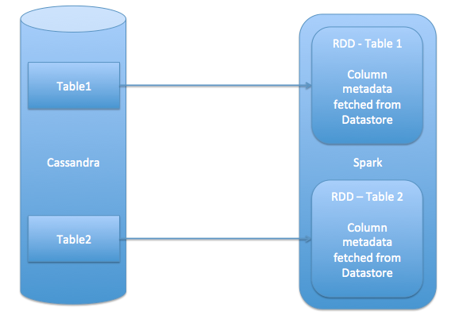
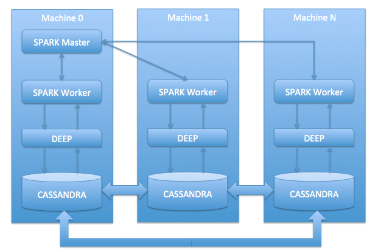

About Stratio Deep
=================

Stratio Deep is one of the core modules on which the Stratio platform is based. It’s a thin integration layer between 
[Apache Spark](http://spark.apache.org "Apache Spark project website") and 
[Apache Cassandra](http://cassandra.apache.org "Apache Cassandra project website").

Table of Contents
=================

-   [Introduction](#introduction)
-   [Features](#features)
-   [Architecture](#architecture)

Introduction
============

Stratio Deep is the module in charge of the integration between [Apache Spark](http://spark.apache.org "Apache Spark project website") and several data stores. We currently support [Apache Cassandra](http://cassandra.apache.org "Cassandra project website"), [MongoDB](http://www.mongodb.org/ "MongoDB website"), [Elasticsearch](http://www.elasticsearch.org/ "Elasticsearch website") and [Aerospike](http://www.aerospike.com/ "Aerospike website") and we are working on adding others soon. Deep is completely open source so we encourage you to develop your own connectors for your data store.

By using Deep you can create Spark RDDs mapped to the data store tables or equivalents and write them back to your data store. Once you have created an RDD you can use all the transformations and actions supported by Spark to process and explore your data in depth. For instance, you can do a join between Cassandra and MongoDB, a group by in MongoDB, a join in Cassandra, map-reduce operations, etc.. You can check the Spark programming guide for further details.

Deep comes with a Java and Scala API for developers and an interactive shell allowing you to analyze your dataset.

Features
========

-   Cassandra, MongoDB, Elasticsearch and Aerospike currenly supported
-   Creates Spark Resilient Distributed Datasets (RDD) from your data store tables.
-   Efficiently writes large RDDs out to your data store table. Will create automatically missing output tables.
-   Ensures that data locality is respected: data is not shuffled to other machines unless strictly needed.
-   Provides ORM-like interface using annotations to map your data store tables to Java/Scala objects.
-   Provides an alternative generic interface to your data store tables using a Cells abstraction avoiding the need to create mapping Java/Scala objects.
-   Friendly API for both Java and Scala developers.
-   Provides a way to register your own callback to handle computation termination events.

Architecture
============

Stratio Deep consists of a set of libraries in Apache Spark that will provide the functionalities described above. 

Apache Spark
------------

Spark started as a research project at the UC Berkeley AMPLab in 2009, and was open sourced in early 2010. Spark is 
a fast and general-purpose cluster computing system that leverages the MapReduce paradigm. It provides high-level 
APIs in Scala, Java and Python.

For more information, please visit the [Apache Spark](http://spark.apache.org/) web.

Stratio Deep
------------

Stratio Deep comes with a user friendly API that allows developers to create RDDs out of Cassandra tables. 
It provides two different interfaces for mapping Cassandra data to Java/Scala objects:

-   **Entities**: will let you map your Cassandra’s tables to entity objects, just like if you were using any other ORM. This abstraction is quite handy, it will let you work on RDD by mapping columns to entity properties and using their getter and setter to access the data. The figure below shows this paradigm:

-   **Cells**: a generic API that will let you work on Cassandra RDD without Scala/Java entity objects, by fetching automatically the columns metadata along with the data itself from the database. This interface is a little bit more cumbersome to work with (see the example below), but has the advantage that it does not require the definition of additional classes.

A common Spark-Cassandra integration cluster will look like the figure below:

